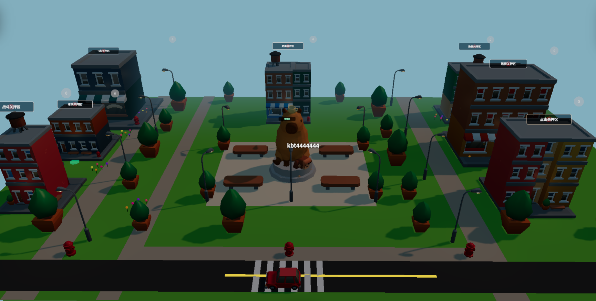
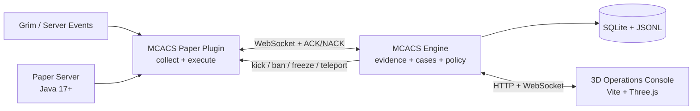

<div align="center">

# MCACS

### Minecraft Anti-Cheat Operations Console

把 Paper 事件、反作弊证据、调查案件和管理员操作集中到一座实时 3D 城镇中。

_An open-source anti-cheat operations console for Paper servers._

[](https://github.com/wzbis666/MCACS-V2.0/actions/workflows/ci.yml)
[](https://github.com/wzbis666/MCACS-V2.0/releases/latest)
[](https://github.com/wzbis666/MCACS-V2.0/pkgs/container/mcacs)
[](docs/COMPATIBILITY.md)
[](LICENSE)

[快速开始](#快速开始) · [核心能力](#核心能力) · [系统架构](#系统架构) · [配置](#关键配置) · [参与贡献](#参与贡献)

</div>



> [!IMPORTANT]
> MCACS 默认以低误报策略运行：`penalty.enabled: false`，检测结果进入调查案件，由管理员复核。请在了解自身服务器网络、插件和玩法基线后，再启用自动处罚。

## MCACS 是什么

MCACS 面向个人服主和中小型 Minecraft 社区，将通常散落在控制台、日志和插件命令里的反作弊工作组合成一条可追踪的运营流程：

```text
采集行为 → 汇聚检测 → 保存证据 → 建立案件 → 人工复核/策略决策 → 可靠执行 → 留存审计
```

它不是单独一个 JAR：Paper 插件负责采集与执行，Node.js 控制层负责证据、案件和策略，浏览器端负责实时可视化。普通用户通过预构建容器和 Release JAR 部署，不需要本地编译源码。

## 核心能力

| 能力       | 当前实现                                                                                                                   |
| ---------- | -------------------------------------------------------------------------------------------------------------------------- |
| 检测接入   | 以 Grim 事件为主要检测源，保留独立 X-Ray 分析；统一映射 Fly、Speed、KillAura、Reach、Scaffold、AutoClicker、X-Ray 七类行为 |
| 证据与案件 | 时间窗口证据缓冲、调查案件、证据时间线、确认/驳回/继续观察、值班摘要                                                       |
| 风险决策   | VP 累积与衰减、玩家基线、风暴门控、新玩家宽限、白名单倍率、策略热重载                                                      |
| 软隔离     | 高置信度且相互独立的证据可触发有限时隔离，并带首次/重复冷却保护                                                            |
| 可靠执行   | Paper 动作 ACK/NACK、重试、`actionId` 幂等、断线重连和封禁状态同步                                                         |
| 运营界面   | Three.js 3D 城镇、NPC 状态、案件面板、证据回放、图形质量和移动端控制                                                       |
| 审计存储   | SQLite 查询数据、JSONL 审计记录、VP 快照、封禁/白名单/申诉持久化                                                           |

### 三套服务器策略

- `survival`：移动、X-Ray、Scaffold、Reach，默认选择。
- `pvp`：移动、KillAura、AutoClicker、Reach。
- `mixed`：启用全部七类行为分析。

## 系统架构



默认端口：

| 端口        | 用途                     | 建议                    |
| ----------- | ------------------------ | ----------------------- |
| `55210/TCP` | 面板、管理 API、健康检查 | 仅向管理员网络开放      |
| `55211/TCP` | Paper 与浏览器 WebSocket | 仅向 Paper 和管理员开放 |

## 快速开始

### 环境要求

- Docker 与 Docker Compose，用于运行预构建控制层。
- Paper 1.20.x 服务端和 Java 17+，用于运行插件。
- Linux `amd64` / `arm64`，或安装 Docker Desktop 的 Windows。

Paper 的实际支持边界请查看[兼容性说明](docs/COMPATIBILITY.md)。

### Linux：一键安装

```bash
curl -fLO https://github.com/wzbis666/MCACS-V2.0/releases/latest/download/install.sh
less install.sh
sudo bash install.sh --minecraft-dir /srv/paper
```

安装器会：

1. 下载 Compose、默认策略、Paper JAR 和校验文件；
2. 校验每个发行附件的 SHA-256；
3. 生成随机 `ACS_AUTH_SECRET`；
4. 拉取预构建 GHCR 镜像并等待健康检查；
5. 安装 Paper JAR，并在首次安装时生成连接配置。

安装固定版本或远程控制层：

```bash
sudo bash install.sh \
  --version v0.1.1 \
  --minecraft-dir /srv/paper \
  --engine-host 10.0.0.20
```

### Windows：一键安装

```powershell
Invoke-WebRequest `
  https://github.com/wzbis666/MCACS-V2.0/releases/latest/download/install.ps1 `
  -OutFile install.ps1

powershell -ExecutionPolicy Bypass -File .\install.ps1 `
  -MinecraftDir "C:\Minecraft\Paper"
```

Windows 需要先启动 Docker Desktop。安装器会保留已有 `.env`、Paper 插件配置和 `penalty-config.yml`。

### 安装后验证

1. 重启 Paper 服务端，不建议使用 `/reload` 升级插件。
2. 在 Paper 控制台运行 `/anticheat status`，确认 WebSocket 为已连接。
3. 使用安装器输出的带 token 地址打开管理面板。
4. 让测试玩家进入服务器，确认加入与移动事件出现在面板。

仅使用 Compose、远程部署、升级、备份和回滚请查看[完整部署指南](DEPLOY.md)。

## 关键配置

### 环境变量

| 变量              | 可选值 / 示例                        | 默认值      |
| ----------------- | ------------------------------------ | ----------- |
| `ACS_AUTH_SECRET` | 长随机字符串；Paper 与控制层必须一致 | 必填        |
| `ACS_MODE`        | `dashboard` / `headless`             | `dashboard` |
| `ACS_PRESET`      | `survival` / `pvp` / `mixed`         | `survival`  |
| `ACS_HTTP_PORT`   | 面板宿主机端口                       | `55210`     |
| `ACS_WS_PORT`     | WebSocket 宿主机端口                 | `55211`     |
| `MCACS_VERSION`   | `0.1.1` / `latest`                   | `latest`    |

### 处罚策略

`penalty-config.yml` 支持运行时热重载。默认关闭自动处罚：

```yaml
detection:
  source: grim
  legacy_xray_enabled: true
  strike_window_minutes: 30

penalty:
  enabled: false
  warning_duration_ms: 6000
  second_offense_ban_duration: 1h
```

更改阈值前请保留数据备份，并先在观察模式中验证误报情况。安装器升级时不会覆盖现有策略，新默认值会写入 `penalty-config.yml.dist` 供比较。

## Release 提供什么

每个稳定版本都应包含以下可验证产物：

| 产物                 | 用途                       |
| -------------------- | -------------------------- |
| `MCACS-Paper.jar`    | 放入 Paper 的 `plugins/`   |
| `compose.yml`        | 拉取对应的 GHCR 控制层镜像 |
| `penalty-config.yml` | 低误报默认策略             |
| `install.sh`         | Linux 安装与升级           |
| `install.ps1`        | Windows 安装与升级         |
| `SHA256SUMS.txt`     | 离线校验发行文件           |

镜像标签：

```text
ghcr.io/wzbis666/mcacs:0.1.1
ghcr.io/wzbis666/mcacs:0.1
ghcr.io/wzbis666/mcacs:latest
```

## 从源码开发

需要 Node.js 20、Java 17 和 Maven 3.6+：

```bash
npm ci
npm ci --prefix town-frontend

npm test
npm run build
npm run build:paper
npm --prefix town-frontend run build
git diff --check
```

本地从源码构建容器：

```bash
cp .env.example .env
docker compose up -d --build
```

### 仓库结构

```text
src/plugin/             检测、证据、案件、处罚和管理 API
src/bridge/             控制层到 3D 场景的事件桥接
src/contracts/          Paper、控制层和前端的共享契约
spigot-plugin/          Paper 采集与动作执行插件
town-frontend/          Vite + Three.js 运营界面
scripts/                Linux / Windows 发行安装器
.github/workflows/      CI、GHCR 和 GitHub Release 自动化
```

## 安全与成熟度说明

- 当前是早期公开版本；生产升级前请备份 `data/`、`.env` 和 `penalty-config.yml`。
- 控制层使用共享密钥认证。不要把 token 提交到仓库、日志或公开 Issue。
- 不建议把 `55210`、`55211` 直接暴露到公网；优先使用防火墙白名单、VPN 或 HTTPS 反向代理。
- 项目编译目标为 Spigot API 1.20.1，预期运行系列为 Paper 1.20.x；尚未宣称覆盖所有 Paper 构建。
- 自动处罚关闭不代表检测结论绝对准确，管理员仍应结合网络延迟、TPS、玩法和其他插件进行复核。

安全漏洞请按照 [SECURITY.md](SECURITY.md) 私下报告，不要在公开 Issue 中提供利用细节。

## 文档

- [部署、升级、回滚与排障](DEPLOY.md)
- [兼容性与发布测试矩阵](docs/COMPATIBILITY.md)
- [开发计划](docs/DEVELOPMENT_PLAN.md)
- [贡献指南](CONTRIBUTING.md)
- [最新 Release](https://github.com/wzbis666/MCACS-V2.0/releases/latest)

## 参与贡献

欢迎提交可复现的 Bug、兼容性报告和 Pull Request。请在报告中包含：MCACS 版本、Paper 构建、Java 版本、CPU 架构、安装方式和已脱敏日志。

提交代码前请运行完整验证门槛，并避免把玩家 IP、认证 token 或真实处罚数据加入测试样本。

## 鸣谢与许可证

3D 城镇运营界面的交互方向受到 [Agentshire](https://github.com/Agentshire/Agentshire) 启发。

MCACS 使用 [MIT License](LICENSE) 开源。本项目不是 Mojang Studios 或 Microsoft 的官方产品；使用者应遵守 Minecraft EULA、服务器所在地法律和社区规则。
