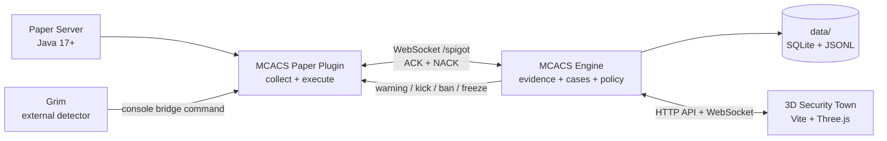

<!-- markdownlint-disable MD033 MD041 -->

<div align="center">


# MCACS

<p><strong>Minecraft Anti-Cheat Security Town</strong></p>

把反作弊后台做成一座可以巡查、取证和裁决的 3D 安全小镇。

_A self-hosted anti-cheat investigation console for Paper servers._

[](https://github.com/wzbis666/MCACS-V2.0/actions/workflows/ci.yml)
[](https://github.com/wzbis666/MCACS-V2.0/releases/latest)
[](https://github.com/wzbis666/MCACS-V2.0/pkgs/container/mcacs)
[](docs/COMPATIBILITY.md)
[](LICENSE)

[认识 MCACS](#认识-mcacs) · [当前能力](#当前能力) · [快速部署](#快速部署) · [配置与安全](#配置与安全) · [参与开发](#参与开发)

</div>

<!-- markdownlint-enable MD033 MD041 -->


> [!NOTE]
> 本文描述当前仓库代码。GitHub Release 是面向服主的稳定构建，可能暂时落后于开发分支中的界面更新。

## 项目状态

| 项目 | 当前状态 |
| --- | --- |
| 仓库版本 | `0.1.1`，早期公开版本 |
| 管理界面 | 仅桌面端，最小视口 `1024 × 640`，建议 `1440 × 900` 或更高 |
| 服务端目标 | Java 17；编译目标为 Spigot API `1.20.1`，预期用于 Paper 1.20.x |
| 控制层 | Node.js 20.19.x / 22.12+、Fastify、WebSocket |
| 可视化 | Vite、TypeScript、Three.js |
| 数据方式 | `data/` 下的本地 SQLite、JSON 与 JSONL 数据 |
| 默认检测源 | Grim 信号，另保留 MCACS 内置 X-Ray 分析 |

> [!CAUTION]
> `penalty.enabled: false` 只关闭 **VP 阈值驱动的自动处罚**，不等于纯观察模式。
> 当前已提交版本中，Grim 高可信信号或 30 分钟内的重复信号仍会触发临时封禁；
> 达到双高独立证据条件的案件也可能自动踢出玩家。请先在测试服校准阈值与处罚链路。

## 认识 MCACS

MCACS 面向个人服主和中小型 Minecraft 社区。它把散落在控制台、反作弊插件和人工判断中的工作串成一条可以回看、复核和追责的调查流程：

```text
游戏事件 / Grim 信号
        ↓
统一分类与证据缓冲
        ↓
风险聚合与调查案件
        ↓
管理员复核或有限自动措施
        ↓
Paper 动作执行与 ACK
        ↓
本地审计和历史查询
```

项目由三个独立层组成：

- **MCACS Paper Plugin**：采集玩家、移动、战斗和方块事件，接收并执行管理动作。
- **MCACS Engine**：负责检测映射、证据、案件、VP、策略、API、WebSocket 和持久化。
- **3D Security Town**：把玩家、案件和管理动作映射成可交互的小镇、NPC 与建筑区域。

3D 前端只负责展示和操作入口，不参与权威检测决策。

## 当前能力

| 模块 | 已实现内容 |
| --- | --- |
| 事件接入 | Paper 事件采集、Grim 控制台信号桥接、断线重连、心跳与 TPS 状态 |
| 行为分类 | Fly、Speed、KillAura、Reach、Scaffold、AutoClicker、X-Ray 七类统一视图 |
| 调查案件 | 同一玩家信号聚合、风险与可信度、待审案件、确认、驳回、继续观察 |
| 证据系统 | 最近 20 秒事件缓冲、案件快照、时间线、TPS、Ping、状态效果与豁免上下文 |
| 运营信息 | 离线值班摘要、案件质量统计、告警、封禁、白名单和申诉数据 |
| 动作执行 | warning、kick、ban、unban、freeze、teleport；ACK/NACK、重试和 `actionId` 幂等 |
| 3D 小镇 | 游戏式开始界面、NPC 状态、七类关押区、案件调查台、玩家详情与记录查询 |
| 本地持久化 | 检测记录、案件、证据、VP、封禁、申诉、软处置和案件复核记录 |

### 游戏化桌面界面

开始界面直接延续小镇的低多边形视觉语言，进入值班后可以：

- 观察在线与历史玩家 NPC 的状态变化；
- 聚焦待审核 NPC，并打开案件与证据时间线；
- 在管理中心查看离线期间摘要；
- 执行封禁、解封、白名单和继续观察等操作；
- 使用鼠标中键或右键旋转、`Shift + 中键` 平移、滚轮缩放；
- 在开始界面使用 `F1` 查看玩法说明，进入小镇后使用 `M` 切换提示音。

开始界面是“开始值班”的游戏入口，不是账号登录页。真正的访问控制来自 `ACS_AUTH_SECRET` 共享密钥。

### 检测策略

`ACS_PRESET` 提供三套内置检测器组合：

| 预设 | 内置检测范围 | 适合场景 |
| --- | --- | --- |
| `survival` | Fly、Speed、X-Ray、Scaffold、Reach | 生存服，默认值 |
| `pvp` | Fly、Speed、KillAura、AutoClicker、Reach | PvP 服务器 |
| `mixed` | 全部七类 | 混合玩法 |

当前预设只过滤 MCACS 内置检测器，不会过滤外部 Grim 桥接信号；Grim 的实际触发范围由它自己的 `punishments.yml` 决定。

## 系统架构



默认网络：

| 端口 | 用途 | 暴露建议 |
| --- | --- | --- |
| `55210/TCP` | 3D 面板、管理 API、健康检查 | 仅允许管理员网络访问 |
| `55211/TCP` | Paper 与浏览器 WebSocket | 仅允许 Paper 和管理员网络访问 |

Release Compose 可以映射宿主机端口，但前端默认仍按 `55210/55211` 连接。
自定义端口时需要配置反向代理，或使用 `VITE_API_BASE` 与 `VITE_WS_URL` 重新构建前端。

## 快速部署

### 运行条件

- Docker 与 Docker Compose；
- Paper 1.20.x 服务端与 Java 17+；
- Linux `amd64` / `arm64`，或已启动 Docker Desktop 的 Windows；
- 如使用默认 Grim 检测源，需要另行安装兼容的 Grim 及其依赖。

MCACS 编译目标是 Spigot API 1.20.1，但尚未对所有 Paper 1.20.x 构建完成实机认证。生产部署前请查看[兼容性说明](docs/COMPATIBILITY.md)。

### Linux

```bash
curl -fLO https://github.com/wzbis666/MCACS-V2.0/releases/latest/download/install.sh
less install.sh
sudo bash install.sh --minecraft-dir /srv/paper
```

远程运行控制层或安装固定版本：

```bash
sudo bash install.sh \
  --version v0.1.1 \
  --minecraft-dir /srv/paper \
  --engine-host 10.0.0.20
```

### Windows

先启动 Docker Desktop，再以管理员身份运行 PowerShell：

```powershell
Invoke-WebRequest `
  https://github.com/wzbis666/MCACS-V2.0/releases/latest/download/install.ps1 `
  -OutFile install.ps1

Get-Content .\install.ps1

powershell -ExecutionPolicy Bypass -File .\install.ps1 `
  -MinecraftDir "C:\Minecraft\Paper"
```

安装器会保留已有的 `.env`、Paper 插件配置和 `penalty-config.yml`。

### 连接 Paper

安装器会把 `MCACS-Paper.jar` 放入 Paper 的 `plugins/`。首次启动后，确认 `plugins/AntiCheatMonitor/config.yml`：

```yaml
ws-uri: "ws://ENGINE_HOST:55211/spigot"
auth-token: "与 ACS_AUTH_SECRET 完全相同"
server-name: "main-server"
sample-interval: 50
```

重启 Paper，不建议使用 `/reload` 升级插件。随后执行：

1. 在 Paper 控制台运行 `/anticheat status`，确认 WebSocket 已连接；
2. 访问 `http://ENGINE_HOST:55210/?token=ACS_AUTH_SECRET`；
3. 让测试玩家进入服务器，确认加入和移动事件出现在 3D 小镇；
4. 检查 `data/` 是否生成持久化记录。

### 接入 Grim

Release 不包含 Grim，也不会自动修改 Grim 配置。使用默认 `detection.source: grim` 时：

1. 单独安装并验证 Grim；
2. 将 [Grim 桥接模板](deploy/grim/punishments.yml) 合并到 Grim 的 `punishments.yml`；
3. 重启 Paper，并用测试账号验证“Grim 信号 → MCACS 案件 → 动作 ACK”完整链路。

仓库模板针对 Grim 2.3.73 编写，不代表所有 Grim 版本都已验证。若未接入 Grim，默认配置下仍会保留 MCACS 的独立 X-Ray 分析，但不会获得完整的移动与战斗信号。

更多 Compose、升级、备份、回滚与排障步骤见[完整部署指南](DEPLOY.md)。

## 配置与安全

### 环境变量

| 变量 | 可选值 / 示例 | 默认值 |
| --- | --- | --- |
| `ACS_AUTH_SECRET` | 独立的长随机密钥 | Release 部署必填 |
| `ACS_MODE` | `dashboard` / `headless` | `dashboard` |
| `ACS_PRESET` | `survival` / `pvp` / `mixed` | `survival` |
| `ACS_HTTP_HOST` | `127.0.0.1` / `0.0.0.0` | 源码 `127.0.0.1`；Release `0.0.0.0` |
| `ACS_WS_HOST` | `127.0.0.1` / `0.0.0.0` | 源码 `127.0.0.1`；Release `0.0.0.0` |
| `ACS_HTTP_PORT` | Release 宿主机 HTTP 映射 | `55210` |
| `ACS_WS_PORT` | Release 宿主机 WS 映射 | `55211` |
| `MCACS_VERSION` | 版本号 / `latest` | `latest` |

Release Compose 强制设置认证密钥；源码 Compose 允许空值用于本机开发。
**空的 `ACS_AUTH_SECRET` 会关闭 API 与 WebSocket 鉴权，绝不能用于可被外部访问的环境。**

### 处罚配置

`penalty-config.yml` 支持热重载：

```yaml
detection:
  source: grim
  legacy_xray_enabled: true
  strike_window_minutes: 30

penalty:
  enabled: false
  warning_duration_ms: 6000
  second_offense_ban_duration: 1h
```

这里的 `enabled: false` 只控制 VP 处罚引擎。Grim 临时封禁与双高案件自动踢出是独立路径，修改配置前务必阅读本 README 顶部的安全提示并在测试服验证。

软处置中的 10 / 30 分钟是系统防止重复触发 kick 的内部冷却，并不会阻止玩家重新连接。

### 部署安全边界

- 当前只有共享密钥，没有多用户、角色权限或内置 TLS；
- 静态页面与 `/api/health` 无需认证；其他 `/api/*` 与 WebSocket 才校验共享密钥；
- 不要把 `55210` 和 `55211` 直接暴露到公网，优先使用防火墙、VPN 或 HTTPS/WSS 反向代理；
- 带 `?token=` 的地址可能进入浏览器历史与代理日志，分享截图或日志前请脱敏；
- 升级前备份 `data/`、`.env` 和 `penalty-config.yml`；
- 使用 `SHA256SUMS.txt` 校验 Release 附件；
- queued / delivered / executed 动作审计目前只保存在引擎内存中，并非持久化事务日志；
- 3D 界面仅支持桌面浏览器，不包含手机端布局或触摸控制。

安全漏洞请按照 [SECURITY.md](SECURITY.md) 私下报告，不要在公开 Issue 中披露利用细节。

## 参与开发

### 本地开发

需要 Node.js 20.19.x 或 22.12+、Java 17 和 Maven 3.6+：

```bash
npm ci
npm ci --prefix town-frontend
```

分别启动控制层与 Vite 前端：

```bash
# Terminal 1: HTTP 55210 / WebSocket 55211
npm run dev

# Terminal 2: http://127.0.0.1:3000
npm --prefix town-frontend run dev
```

直接运行 `npm run dev` 不会自动读取 `.env`；需要认证时请通过当前 Shell、系统服务或容器显式设置环境变量。
同时使用 `http://127.0.0.1:3000/?token=...` 打开 Vite 页面，或在前端进程中设置 `VITE_ACS_AUTH_TOKEN`。

提交前运行完整验证门槛：

```bash
npm test
npm run build
npm run build:paper
npm --prefix town-frontend run build
git diff --check
```

CI 会执行单元测试、TypeScript / Java / 前端构建和容器构建，但这不等于真实 Paper 服务器与全部浏览器的运行兼容认证。

### 仓库结构

```text
src/plugin/             检测、证据、案件、处罚、HTTP 与 WebSocket
src/bridge/             控制层与 3D 场景之间的事件翻译
src/contracts/          Java、控制层和前端使用的共享协议
spigot-plugin/          Paper 事件采集与动作执行插件
town-frontend/          Vite + Three.js 桌面端安全小镇
deploy/grim/            Grim 信号桥接配置模板
scripts/                Linux / Windows Release 安装器
docs/                   兼容性、开发计划和界面截图
.github/workflows/      CI、GHCR 镜像与 Release 自动化
```

### 文档

- [部署、升级、回滚与排障](DEPLOY.md)
- [兼容性与发布测试矩阵](docs/COMPATIBILITY.md)
- [开发计划](docs/DEVELOPMENT_PLAN.md)
- [贡献指南](CONTRIBUTING.md)
- [最新 Release](https://github.com/wzbis666/MCACS-V2.0/releases/latest)

欢迎提交可复现的 Bug、兼容性报告与 Pull Request。报告中请包含 MCACS 版本、Paper 构建、Java 版本、CPU 架构、安装方式和已脱敏日志。

## 许可证

MCACS 使用 [MIT License](LICENSE) 开源。
本项目不是 Mojang Studios、Microsoft 或 Grim Anticheat 的官方产品。
使用者应遵守 Minecraft EULA、服务器所在地法律和社区规则。
